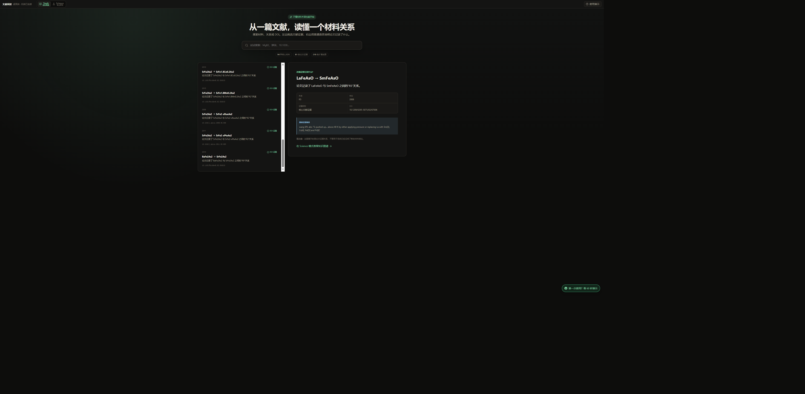
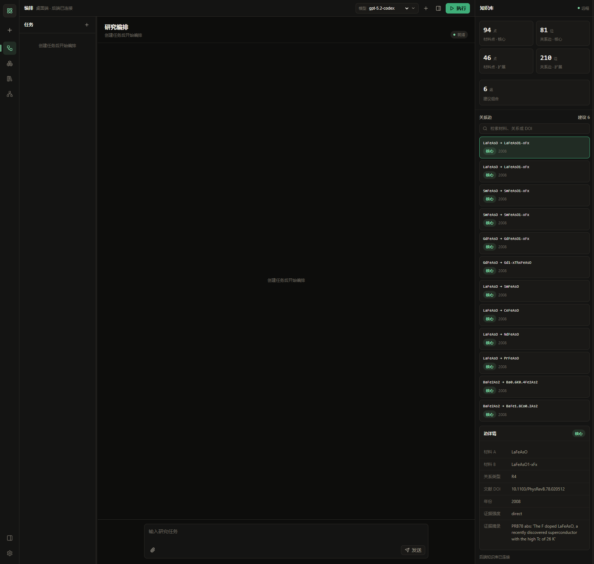
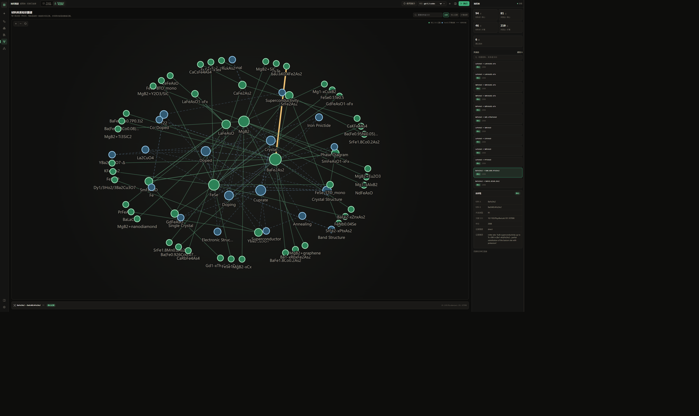
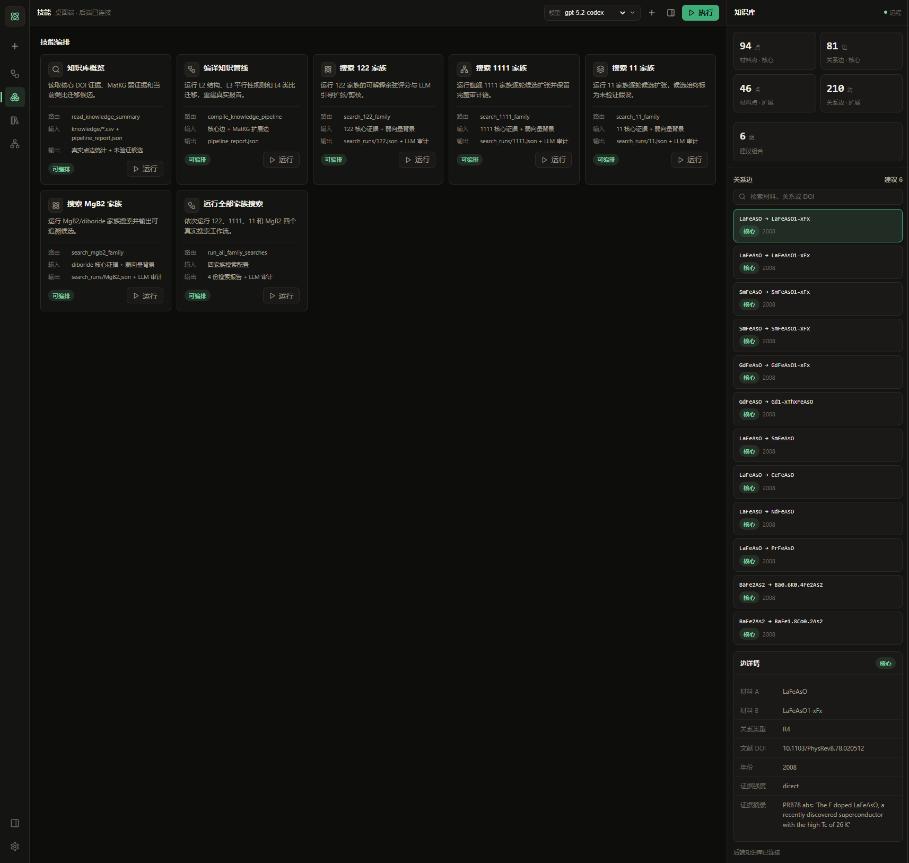

# CAP 本地 Demo 操作手册

## Demo 要证明什么

这个 Demo 用来证明三件事：

1. UI-3 前端能够读取本仓库的真实材料知识数据；
2. 点击页面操作会调用 Node API 和 Python 工作流，而不是返回硬编码样例；
3. 核心 DOI 证据、MatKG 弱证据和未验证候选在界面上保持分层。

## 1. 启动

首次运行：

```powershell
cd workbench
npm.cmd install
npm.cmd --prefix server install
```

启动前后端：

```powershell
npm.cmd run dev
```

打开 `http://localhost:5173`。Windows PowerShell 如果禁止执行 `npm.ps1`，请使用本文中的 `npm.cmd`。

如默认 Python 不含项目依赖，可先指定解释器：

```powershell
$env:PYTHON_BIN='E:\Anaconda3\envs\camel_agent\python.exe'
npm.cmd run dev
```

## 2. Track：用非专业模式读一条文献

应用默认打开 `Track · 轻松阅读`：

1. 在大搜索框输入材料名、关系或 DOI；
2. 点击左侧任意文献证据卡片；
3. 在右侧阅读普通语言说明、关系、年份、DOI 和原始证据摘录；
4. 点击“在 Science 模式查看知识图谱”继续深入。

Track 只展示核心 DOI 证据，不会把 MatKG 扩展线索或模型候选伪装成已经验证的论文结论。



## 3. Science：确认真实知识数据已连接

点击顶部 `Science · 专业研究`。页面顶部应显示“后端已连接”，右侧知识库面板应显示：

页面顶部应显示“后端已连接”，右侧知识库面板应显示：

- 核心材料：94；
- 核心关系边：81；
- 扩展材料：46；
- MatKG 扩展关系边：210；
- 建议组合：6。

点击右侧任意关系，可以查看材料 A、材料 B、关系类型、DOI、年份、证据强度和摘录。输入材料名称或 DOI 可以筛选关系。



## 4. 图形化：查看真实材料知识图谱

在 Science 模式点击左侧“知识图谱”：

- 圆点代表材料；圆点大小代表当前视图中的关系数量；
- 实线绿色关系是核心 DOI 证据；
- 蓝色虚线关系是 MatKG 扩展线索；
- 点击圆点或连线，底部会显示关系类型和 DOI；
- 搜索框可以聚焦某个材料或 DOI；
- “核心证据 / 扩展线索”按钮可以切换证据层级。

图谱直接使用 `/knowledge/search` 返回的真实 291 条关系，不是装饰性示意图。



## 5. 技能页：运行真实工作流

点击左侧“技能”。目前可操作的入口包括：

- 知识库概览；
- 编译知识管线；
- 搜索 122 家族；
- 搜索 1111 家族；
- 搜索 11 家族；
- 搜索 MgB2 家族；
- 运行全部家族搜索。



建议第一次 Demo 点击“知识库概览”右下角的“运行”。系统会：

1. 创建一个任务；
2. 调用本地 `/api/v1/workflow/run`；
3. 根据 `agent/workflow.json` 白名单选择 `read_knowledge_summary`；
4. Node 启动 `src/ui_bridge.py`；
5. Python 读取真实产物并把汇总返回页面。

预期最终显示：

> 真实工作流已完成：140 个知识节点、291 条边、326 组非退化证据。

## 6. 页面内 60 秒演示

任意模式点击顶部“使用演示”。引导包含三步：

1. Track 文献阅读；
2. Science 真实知识图谱；
3. Python 真实工作流。

每一步都有直达按钮，不要求用户先理解专业导航。

## 7. 旗舰案例：1111 家族搜索

在“搜索 1111 家族”卡片点击“运行”。完成后应生成或更新：

- `outputs/search_runs/1111.json`；
- `outputs/llm_calls/*.json` 审计记录。

当前验收案例保留 20 个未验证候选。候选表示值得继续检索或实验验证的类比方向，不表示已经发现新材料。

注意：搜索会更新仓库中的运行产物。需要保持 Git 工作区干净时，建议先使用独立工作树或备份当前 `outputs/search_runs`。

## 8. Demo 边界

- Web 版已经可以本地运行和演示；
- Electron 35 在当前 Windows 验收机发生原生崩溃，暂不作为正式入口；
- “图谱/CiteSpace”页面仍是继承的工作台外壳，不应演示为已经接入真实 CiteSpace 分析；
- 当前知识存储是 CSV/JSON，不是正式数据库；
- 任务和作业状态保存在 Node 内存中，重启服务后不会保留。

## 9. 验收命令

```powershell
python -m unittest discover -s tests
cd workbench
npm.cmd run typecheck
npm.cmd run build
```

如果页面显示“本地模式”而不是“后端已连接”，检查 `8787` 端口是否被占用，以及 Node API 是否正常启动。
