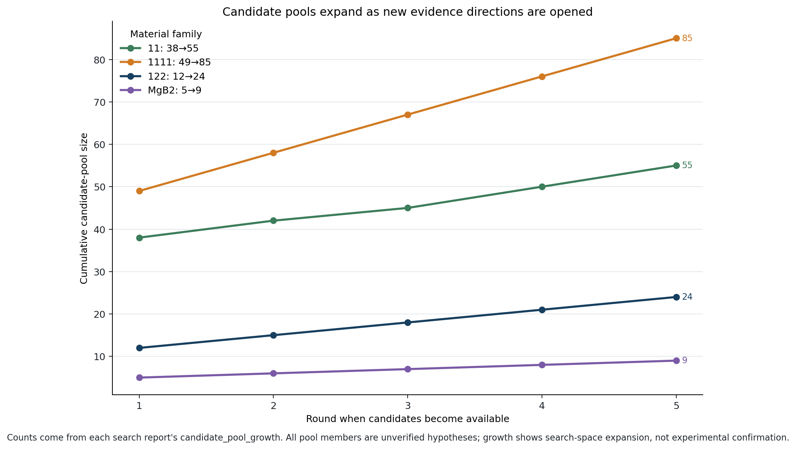

# 1111 家族旗舰案例：候选池怎样从 49 扩到 85

## 先说结论

这次修改证明了一件具体的事：搜索不再把开跑前生成的 49 个候选反复切片，而是在每轮结束后开放新的类比证据方向。1111 家族的累计候选池按轮次变为 **49 → 58 → 67 → 76 → 85**；第 2–5 轮实际观察的候选里，每一轮都有第 1 轮完整候选池不可能包含的新 ID。

这不是“发现了 85 个新超导体”。85 是待筛选的向量类比假设总池；本次只观察 20 个，保留其中 12 个非退化且分数大于 0 的候选方向。所有条目仍是 `候选假设(未验证)`。



## 起点里有什么

1111 目标家族有 9 个核心 DOI 证据材料：LaFeAsO、LaFeAsO1-xFx、SmFeAsO、SmFeAsO1-xFx、GdFeAsO、GdFeAsO1-xFx、CeFeAsO、NdFeAsO、PrFeAsO。

搜索把核心边中同一种关系的两条已知变换配成“类比源”。可用的非退化来源按关系类型计数为：R1 6 组、R2 9 组、R3 6 组、R5 6 组、R8 3 组、R9 15 组。旧代码对每种关系只拿全局最好的一组，因此首轮 49 个候选一旦生成就永远不变；新代码保留完整排序，但首轮仍只开放每种关系的第 1 组，之后再逐轮开放。

候选 ID 现在同时包含关系类型、源变换、参考变换和目标材料，例如：

`R3|FeSe->FeSe0.5Te0.5~FeSe->FeSe1-xSx|CeFeAsO`

这样两个来源变换相同、参考变换不同的证据方向不会再碰撞成同一个 ID。

## 五轮实际发生了什么

| 轮次 | 轮初累计池 | 本轮抽取 | 来源排名与方向 | 分数 | 本轮结果 | 轮后动作 |
|---|---:|---:|---|---:|---|---|
| 1 | 49 | 4 | R3 rank 0：FeSe→FeSe0.5Te0.5，与 FeTe→FeSe0.5Te0.5 对照 | 1.0（signed -1.0） | 4 个保留 | 深挖 R3，新增 9，池到 58 |
| 2 | 58 | 4 | R3 rank 1：FeSe→FeSe0.5Te0.5，与 FeSe→FeSe1-xSx 对照 | 0.5 | 4 个保留 | 深挖 R3，新增 9，池到 67 |
| 3 | 67 | 4 | R3 rank 2：FeTe→FeSe0.5Te0.5，与 FeSe→FeSe1-xSx 对照 | 0.5（signed -0.5） | 4 个保留 | 深挖 R3，新增 9，池到 76 |
| 4 | 76 | 4 | R3 rank 3：BaFe2As2→BaFe2(As0.7P0.3)2，与 FeSe→FeSe0.5Te0.5 对照 | 0.0 | 4 个剪枝 | 深挖 R3，新增 9，池到 85 |
| 5 | 85 | 4 | R3 rank 4：同一 122 源变换，与 FeSe→FeSe1-xSx 对照 | 0.0 | 4 个剪枝 | 连续两轮无新正分候选，停止 |

前三轮共保留 12 个候选；第 4、5 轮虽然来源本身不是编码退化，但两条变换的余弦为 0，代理分数也为 0，因此全部明确剪枝。停止原因是 `converged_two_rounds_without_new_non_degenerate_candidate`，不是把轮数跑满后假称收敛。

这里的“新”有严格的机器定义：候选 ID 不在首轮完整的 49 个 ID 集合中。自查脚本确认后续实际观察到 16 个首轮外 ID，并确认第 2、3、4、5 轮各自都至少包含一个这样的 ID。这直接满足了“第 N+1 轮必须出现第 1 轮不可能枚举到的 ID”的结构验收标准。

## 拿一个候选说人话

第 2 轮给 CeFeAsO 的候选使用两个已知 R3 变换作类比：

- 模板：FeSe → FeSe0.5Te0.5；
- 平行参考：FeSe → FeSe1-xSx；
- 迁移目标：CeFeAsO；
- 源/参考变换余弦：+0.5；
- 向量层预测增量：Se -0.25、Te +0.25；
- 状态：`候选假设(未验证)`。

它表达的不是“CeFeAsO 按这个配方一定可合成或会提高 Tc”，而是“一个有核心 DOI 证据的阴离子取代方向，在向量空间里值得拿来询问 1111 目标”。下一步仍必须查 Materials Project、OQMD、NOMAD 或原始文献；若没有报道，也只能列为待实验验证的 Research Gap。

## LLM 到底有没有真的参与

接口参与了，真实模型本次没有成功参与。

每轮有两个逻辑调用：一次候选排序，一次回答“继续深挖还是换方向”，所以 1111 共 5 轮、10 份审计。代码依次尝试 STEP 和 Gemini，但本机环境及约定密钥文件都缺少 `STEP_API_KEY` / `STEP_BASE` / `GEMINI_KEY`，10 次调用都记录为 `heuristic_fallback_not_real_llm`，报告如实写 `real_llm_api_called=false`。没有把启发式输出包装成大模型判断。

当配置补齐后，同一入口会使用真实 provider 的 JSON 排序/扩张建议；本地仍会拒绝模型虚构的候选 ID、已观察 ID和不可扩张的 relation type。数值分数始终由 `rules.cosine` 计算，不交给黑箱生成。

## 哪些数字值得记住

- 9 个 1111 核心目标材料；
- 首轮完整候选池 49；
- 五轮累计池 49 → 58 → 67 → 76 → 85；
- 实际观察 20 个候选 ID，全部唯一；
- 12 个正分非退化候选保留待外部验证，8 个零分候选剪枝；
- 后续轮观察到 16 个首轮外 ID；
- 10 次 LLM 逻辑调用、10 份审计、0 次真实 API 成功调用；
- 旗舰自查 3/3 通过，全家族自查总结果 PASS。

## 诚实的局限

1. **分数评价的是证据方向，不是目标材料。** 同一源/参考证据迁移到不同 1111 目标时分数相同，因此当前排序还不能区分 CeFeAsO 与 LaFeAsO 谁更可能成功。
2. **向量不是位点化学模型。** 成分向量做了全式归一化；某些迁移会产生 Ba、Fe 等联动增量，不能直接当成实验配方。
3. **跨家族迁移可能化学上牵强。** 前三轮主要把 FeSe/FeTe 的 R3 方向迁到 1111 家族。几何平行只说明编码空间中的方向关系，不自动证明晶格位点、相稳定性或 Tc 机制可迁移。
4. **LLM 本次是审计降级。** 真实 STEP/Gemini 未成功调用，所谓“深挖 R3”来自确定性启发式；这验证了接口和状态机，不验证模型判断质量。
5. **候选尚未做数据库交叉验证。** 本文没有把任何候选写进核心知识边，也没有声称存在新材料。

## 怎样复现

```powershell
E:\Anaconda3\python.exe src\search.py
E:\Anaconda3\python.exe src\verify_search.py
E:\Anaconda3\envs\camel_agent\python.exe src\visualize.py
```

机器原始记录见 `outputs/search_runs/1111.json`，自查结论见 `outputs/search_verification.json`，逐次决策见 `outputs/llm_calls/`。
