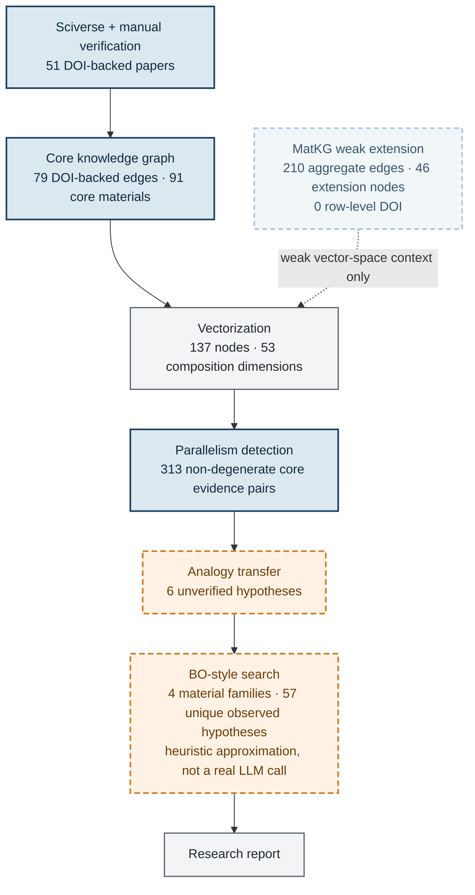

# Knowledge-base construction pipeline

Caption: Solid dark-blue paths are DOI-backed core evidence. The pale dashed MatKG branch contributes only weak vector-space context; orange dashed nodes are unverified hypotheses. All counts come from `pipeline_report.json` and the four `search_runs` JSON files.
